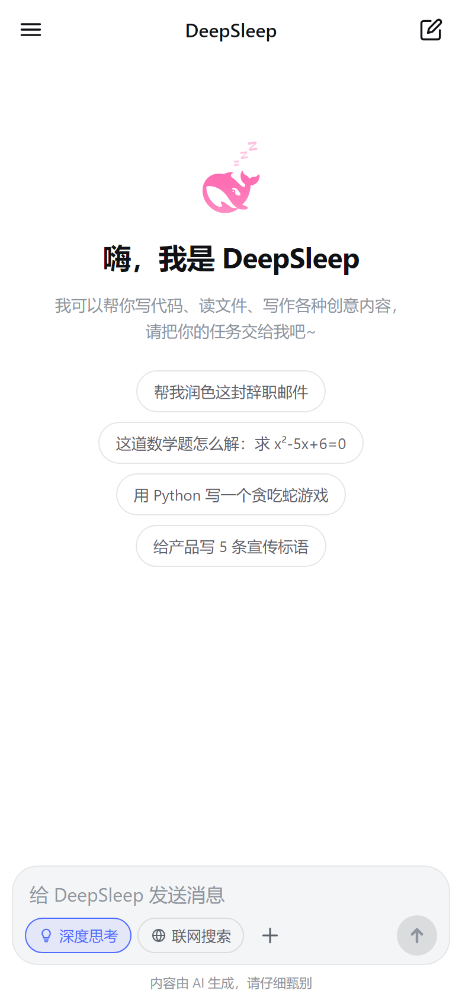
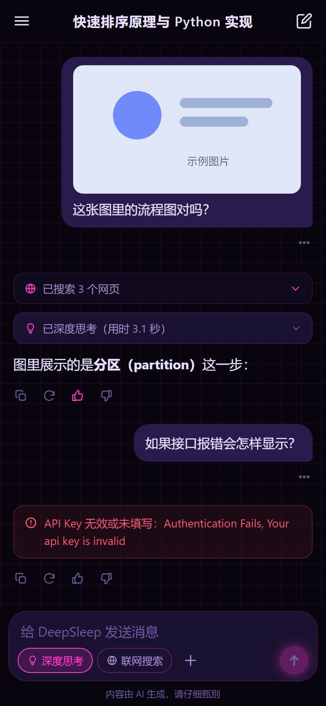
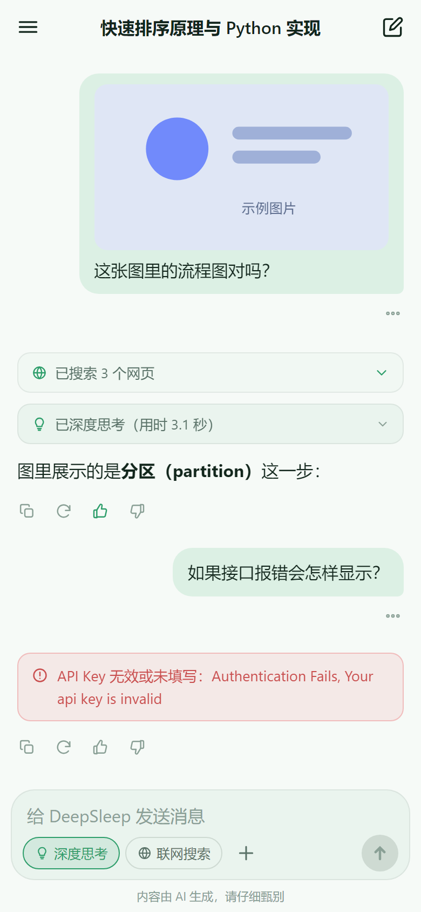
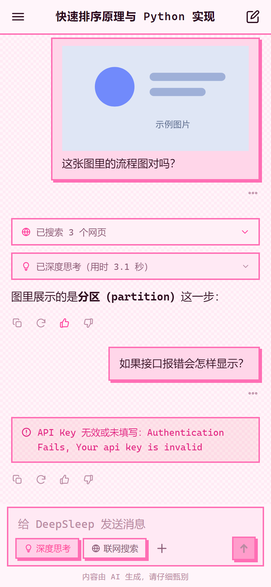
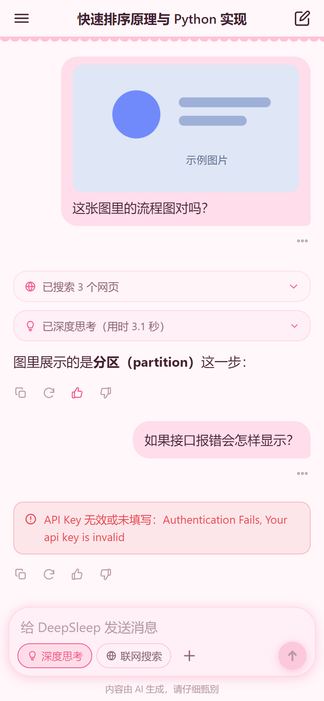
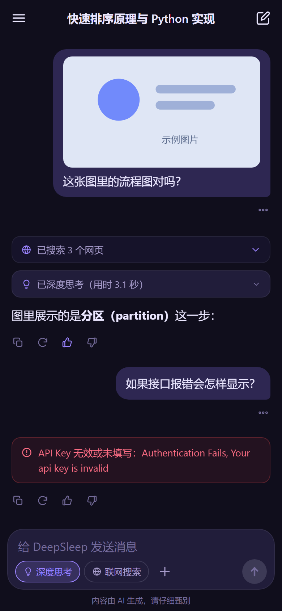
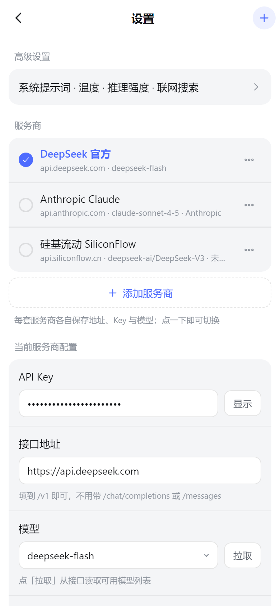
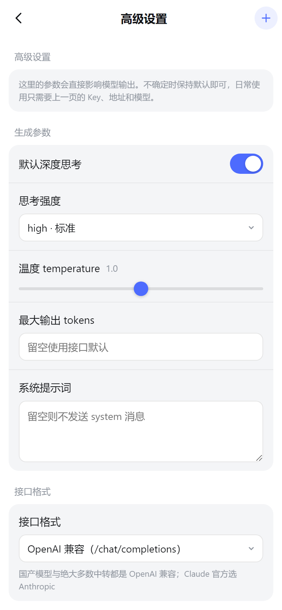
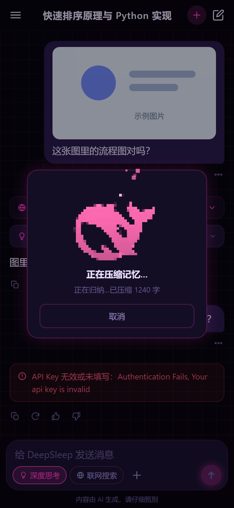

# DeepSleep

A third-party Android client for DeepSeek-compatible LLM APIs — built to look and feel like the official app, but talking to **your own API key** instead of going through official routing.

[English](#english) · [中文](#中文说明)

---

## English

### What is this

DeepSleep is a WebView-based Android chat client. A tiny embedded HTTP server serves the UI from the APK's own assets and doubles as a streaming reverse proxy, so the frontend gets real SSE from any OpenAI-compatible or Anthropic-compatible endpoint without CORS problems.

It is not affiliated with DeepSeek. It ships no API keys and routes nothing through anyone's servers — every request goes from your device straight to the endpoint you configure.

### Features

- **Multi-provider** — keep several endpoints side by side (DeepSeek, OpenAI, Anthropic, OpenRouter, SiliconFlow, Moonshot, Zhipu, DashScope, or anything custom). Each stores its own base URL, key, model and protocol; switch with one tap.
- **Two protocols** — OpenAI-compatible (`/chat/completions`, `Authorization: Bearer`) and Anthropic (`/messages`, `x-api-key`).
- **Streaming with a real thinking chain** — reasoning deltas render into a collapsible block you can fold mid-stream.
- **Markdown, code highlighting, LaTeX** — markdown-it + highlight.js + KaTeX, all vendored locally. Code blocks get a copy button.
- **Image input** — pick from the gallery, auto-downscaled to 1568px on the longest edge.
- **Web search** — the model plans the search first (decides whether it is needed at all, then compresses your question into short keywords), followed by a bounded multi-round retrieval. Results are scored for relevance before they reach the context, so navigation pages and ad farms cannot derail the answer.
- **Long-term memory** — facts and preferences accumulate across conversations. The model extracts them; storing, deduplicating and scoring all happen locally with no embedding service. Three independent gates keep it from eating your context: a master switch, a per-conversation switch, and a hard character budget.
- **Conversation reincarnation** — compress the current chat into a memory summary and carry it into a fresh conversation as an injected system message.
- **Text-to-speech** — reads replies aloud through the system TTS engine, with voice selection, speed and pitch.
- **Seven colour schemes** — official blue, Claude orange, violet, forest, neon cyber, pixel pink and maid pink — plus an accent-colour override, OLED true black, font choice and message density.
- **Lightweight** — 3.3 MB APK, zero third-party Android libraries.

### Screenshots

| Official blue | Neon cyber | Forest |
| --- | --- | --- |
|  |  |  |

| Pixel pink | Maid pink | Violet |
| --- | --- | --- |
|  |  |  |

| Settings | Advanced settings | Reincarnation |
| --- | --- | --- |
|  |  |  |

### Install

Grab the APK from [Releases](../../releases). Android 7.0 (API 24) or newer.

You need your own API key. On first launch go to **Settings → Provider**, fill in the base URL, key and model name, then tap **Fetch** to pull the model list from the endpoint.

### Build from source

There is no Gradle. The whole pipeline is a PowerShell script driving the raw Android toolchain:

```
aapt2 compile → aapt2 link (+assets) → javac → d8 → zip → zipalign → apksigner
```

```powershell
# one-time: fetch JDK 17 + Android build-tools + platform-35
node tools/fetch-toolchain.mjs

# build
powershell -ExecutionPolicy Bypass -File tools/build-apk.ps1
```

Signing uses `keystore/deepseek-orca.jks`, which is **not** in this repository. Supply your own and point `$KEYSTORE` in `tools/build-apk.ps1` at it, or override the passphrase with the `DSH_KS_PASS` environment variable.

> `tools/build-apk.ps1` must stay **ASCII-only**. PowerShell 5.1 decodes BOM-less files using the system ANSI codepage, so a stray non-ASCII comment corrupts parsing and makes signing fail with a misleading error. `tools/audit.mjs` enforces this.

### Preview without an APK

```bash
node tools/preview.mjs 8787   # serves the same UI in a browser, with a mocked API
```

Then open `http://127.0.0.1:8787/?demo=chat&scheme=cyber&theme=dark` to jump straight into a seeded conversation.

### Checks

```bash
node tools/audit.mjs        # static audit: dangling ids, icons, CSS classes, theme completeness
node tools/test-dom.mjs     # 367 DOM assertions (needs the preview server on :8787)
node tools/verify-apk.mjs   # APK structure: entry names, STORED/aligned, required assets
node tools/check-driver.mjs # the injected preview driver must parse
node tools/debug-console.mjs # boots 8 scenes and reports any console noise
```

### Architecture

```
app/
  android/          native shell (Java, no AndroidX)
    java/…/MainActivity.java   WebView host, JS bridge, TTS, splash, insets
    java/…/LocalServer.java    assets server + streaming reverse proxy
    res/                       icons, splash art
  web/              the whole frontend (vanilla ES5, no bundler)
    index.html
    css/app.css
    js/             icons, store, memory, api, search, tts, reincarnate, ui
    vendor/         markdown-it, highlight.js, KaTeX (+ fonts)
    assets/         images
docs/screenshots/   curated screenshots
assets-src/         source images for generated art
tools/              build, preview, test and codegen scripts
```

The UI runs on `http://127.0.0.1:<fixed port>` and the port is pinned (8791-8794) so that `localStorage` keeps a stable origin. Anything durable is additionally written through a native file-backed key-value store, because the WebView's HTTP cache and origin-scoped storage are both easy to get wrong.

### Notes

- **Not affiliated with DeepSeek.** The name and mascot are original; no official assets are used.
- **Your key, your endpoint.** Nothing is routed through a server operated by this project, and the app collects no telemetry.
- Local assets are served with `Cache-Control: no-store`, and the WebView cache is cleared on version change; otherwise an update can pair a new page with a stale script.
- Camera capture is not implemented — it would require FileProvider/AndroidX, and the project deliberately has no third-party Android dependencies.

---

## 中文说明

### 这是什么

DeepSleep 是一个基于 WebView 的安卓聊天客户端。APK 内置一个极小的 HTTP 服务器，既负责把界面从 assets 里发给 WebView，又充当**流式反向代理**——前端因此能拿到真正的 SSE，同时绕开 CORS。

它和 DeepSeek 官方没有关系。仓库里不含任何 API Key，也不经过任何第三方服务器：**每个请求都从你的设备直接发往你自己配置的接口**。

### 功能

- **多服务商** —— 同时保存多套配置（DeepSeek、OpenAI、Anthropic、OpenRouter、硅基流动、Moonshot、智谱、DashScope，或完全自定义），每套各自记录地址、Key、模型和协议，一键切换
- **两种协议** —— OpenAI 兼容（`/chat/completions` + `Bearer`）与 Anthropic（`/messages` + `x-api-key`）
- **流式 + 真实思维链** —— 思考过程单独成块，**流式过程中就能折叠**
- **Markdown / 代码高亮 / 公式** —— markdown-it + highlight.js + KaTeX，全部本地内置，代码块可一键复制
- **识图** —— 从相册选图，自动压到长边 1568px
- **联网搜索** —— 先由模型规划（判断要不要搜、把问题压成短关键词），再做**有上限的多轮检索**；结果先过一遍相关性打分才进上下文，导航页和聚合站带不偏它
- **长期记忆** —— 模型负责提取，本地负责落库/去重/打分，不依赖任何向量服务。**三道闸**防上下文爆炸：总开关、单会话开关、字符预算
- **对话转生** —— 把当前对话压成记忆摘要，带进新对话继续
- **朗读** —— 用系统 TTS 引擎念回复，可选音色、语速、音调
- **七套配色** —— 官方蓝 / 克劳德橙 / 紫罗兰 / 森林绿 / 霓虹赛博 / 像素粉 / 女仆粉，另有强调色覆盖、纯黑模式、字体与密度可选
- **轻量** —— APK 3.3 MB，**零第三方安卓依赖**

### 截图

见上方英文部分的表格。

### 直接安装

到 [Releases](../../releases) 下载 APK。需要 Android 7.0（API 24）以上。

需要你自备 API Key。首次启动 → **设置 → 服务商**，填地址、Key、模型名，点「拉取」从接口读模型列表。

### 从源码构建

没有 Gradle，整条流水线是一个 PowerShell 脚本驱动的原生工具链：

```
aapt2 compile → aapt2 link (+assets) → javac → d8 → zip → zipalign → apksigner
```

```powershell
# 一次性：下载 JDK 17 + Android build-tools + platform-35
node tools/fetch-toolchain.mjs

# 构建
powershell -ExecutionPolicy Bypass -File tools/build-apk.ps1
```

签名用 `keystore/deepseek-orca.jks`，**这个文件不在仓库里**。请自备密钥并修改 `tools/build-apk.ps1` 里的 `$KEYSTORE`，或用环境变量 `DSH_KS_PASS` 覆盖口令。

> `tools/build-apk.ps1` 必须保持**纯 ASCII**。PowerShell 5.1 对无 BOM 文件按系统 ANSI 码页解码，注释里混进一个非 ASCII 字符就会让解析错乱，表现为签名失败且报错完全指不到原因。这条由 `tools/audit.mjs` 强制检查。

### 不装 APK 也能看界面

```bash
node tools/preview.mjs 8787   # 浏览器里跑同一套界面，API 是模拟的
```

打开 `http://127.0.0.1:8787/?demo=chat&scheme=cyber&theme=dark` 可直接进入一个预置了内容的对话。

### 自动化检查

```bash
node tools/audit.mjs        # 静态审计：悬空 id、图标、CSS class、配色完整性
node tools/test-dom.mjs     # 367 条 DOM 断言（需要预览服务器在 :8787）
node tools/verify-apk.mjs   # APK 结构：条目名、STORED/对齐、必需资源
node tools/check-driver.mjs # 预览注入脚本必须能解析
```

### 项目结构

```
app/
  android/          原生外壳（Java，无 AndroidX）
    java/…/MainActivity.java   WebView 宿主、JS 桥、朗读、开屏、系统栏
    java/…/LocalServer.java    资源服务器 + 流式反向代理
    res/                       图标、开屏图
  web/              整个前端（原生 ES5，无打包器）
    index.html
    css/app.css
    js/             icons / store / memory / api / search / tts / reincarnate / ui
    vendor/         markdown-it、highlight.js、KaTeX（含字体）
    assets/         图片
docs/screenshots/   归档截图
assets-src/         生成类图片的原始素材
tools/              构建、预览、测试、代码生成脚本
```

界面跑在 `http://127.0.0.1:<固定端口>`，端口是钉死的（8791-8794），这样 `localStorage` 的源才稳定。而真正需要持久化的数据会再走一遍原生文件 KV —— 因为 WebView 的 HTTP 缓存和按源隔离的存储都很容易出问题。

### 需要注意

- **本项目与 DeepSeek 官方无关**，名称与形象均为原创，未使用官方素材
- **用你自己的 Key 和接口**。不经过本项目运营的任何服务器，也不收集任何遥测
- 本地资源一律 `no-store`，且版本变化时会清一次 WebView 缓存；否则升级后会出现「新页面配旧脚本」
- 未实现拍照输入（需要 FileProvider/AndroidX，而本项目刻意不引入第三方安卓依赖）

---

## 踩过的坑

这些都在代码里修掉了。列出来是因为每一个都花了不少时间，而且都属于「看起来不可能出问题」的那类。

1. **aapt2 在 Windows 上把 assets 条目名写成反斜杠**
   结果是所有前端资源 404、App 一片空白。打包脚本里统一转成正斜杠，并由 `verify-apk.mjs` 守着。

2. **`iconHtml()` 生成的内联样式被引号截断**
   `style="-webkit-mask-image:url("data:...")"` —— 里面那对双引号提前结束了 HTML 属性，于是**每一个动态生成的图标都丢了遮罩**，表现为「消息不能编辑/重新生成」「没有更多菜单」。改用单引号并转义。

3. **CommonMark 的 flanking 规则吃掉了中文加粗**
   `**分区（partition）**这一步` 后面紧跟中文时渲染不出粗体。用哨兵字符在渲染前插入分隔，渲染后再剔除。

4. **鉴权头里的空格被 HTTP 规范化吃掉**
   前端传 `X-Auth-Prefix: "Bearer "`（带尾空格），而头值首尾空白会被裁掉，原生层拼出来是 `Bearersk-xxx`，服务端直接 401 —— **Key 明明有效却提示未授权**。现在只传方案名，空格由原生层补。

5. **WebView 缓存导致「新页面配旧脚本」**
   `LocalServer` 原来只给 `index.html` 发 `no-store`，js/css 被缓存 24 小时。升级后新页面配上旧脚本，切到新配色却提示「已切换到官方蓝」。现在资源一律 `no-store`，且版本变化时主动清缓存。

6. **整个替换 `DS.ui` 让 App 静默不初始化**
   `DS.ui` 本来就是模块且含 `init()`，我把它整个赋值覆盖掉，`main.js` 调用 `DS.ui.init()` 失败 —— 脚本全部正常加载、页面也在，就是从来没初始化过。

7. **预览驱动的模板字符串吃掉 `\n`**
   驱动脚本是模板字符串拼的，里面写的 `\n` 先被转义成真实换行，生成的 JS 语法错误、整段驱动失效。要命的是它**静默失效**（种子数据还在，页面看起来正常，只是截图全都一样）。现在 `check-driver.mjs` 会先解析一遍。

8. **PowerShell 改文本文件把中文写成乱码**
   `Get-Content -Raw` 按 ANSI 读取，UTF-8 中文全毁、还吃掉了引号导致语法错误。教训：**这个环境里不用 PowerShell 改文本文件**。

9. **`.ps1` 里混进中文注释导致签名失败**
   PS 5.1 对无 BOM 文件按 ANSI 解码。改回英文，并由 `audit.mjs` 强制纯 ASCII。

10. **一次失败就被永久隐藏的图片**
    hero 的 `` 上挂着 `onerror="this.style.display='none'"`，只要加载失败过一次就永久不可见，之后换任何图都看不见。改用 `visibility` 并在 `onload` 时恢复。

---

## 签名信息

| | |
| --- | --- |
| 包名 | `com.deepsleep.app` |
| 版本 | 1.5.1（versionCode 14） |
| 签名方案 | APK Signature Scheme v2 + v3（自签名） |
| 最低版本 | Android 7.0（API 24） |
| 目标版本 | Android 14（API 34） |

**升级注意**：包名从 `com.deepseek.orca` 改成 `com.deepsleep.app` 的那一版需要先卸载旧版，数据不会自动迁移。

## License

[MIT](LICENSE).

Not affiliated with DeepSeek. The name and mascot are original artwork; no
official assets are included. You are responsible for complying with the terms
of whichever API provider you point this at.
